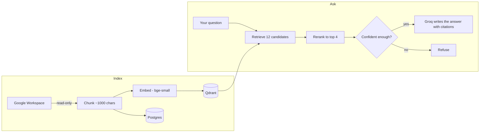

# Relay - Cited Answers From Your Own Google Workspace

Your work is scattered across Drive, Gmail, Calendar and Sheets, and there is no single place to ask "what did we decide about X?" Relay indexes them on your own computer and answers with a link to the exact passage it used - or says it doesn't know, instead of guessing.

[](https://relayby.filheinzrelatorre.com)
[](https://www.npmjs.com/package/relay-workspace)
[](https://github.com/jabluetooth/relay/actions/workflows/ci.yml)


<br>

**Website:** [relayby.filheinzrelatorre.com](https://relayby.filheinzrelatorre.com) - [how it works](https://relayby.filheinzrelatorre.com/how-it-works) · [security](https://relayby.filheinzrelatorre.com/security) · [get started](https://relayby.filheinzrelatorre.com/get-started) · [design](https://relayby.filheinzrelatorre.com/design)

Relay is self-hosted, so there is no hosted demo of the app itself. It runs on your machine, with your database and your keys, and your documents never touch a server of mine.

## Quick start

You need [Node.js](https://nodejs.org) 20.9+ and [Docker Desktop](https://www.docker.com/products/docker-desktop/) running.

```bash
npx relay-workspace
```

The first run asks for three sets of keys (Google Cloud, Hugging Face, Groq), starts Postgres and Qdrant in Docker, creates the tables and starts Relay at `http://localhost:3000`. Then open **Connections**, connect Drive and press **Sync**. The [get started guide](https://relayby.filheinzrelatorre.com/get-started) walks through the Google Cloud part step by step.

Prefer a permanent command? `npm install -g relay-workspace`, then run `relay`.

| Command | What it does |
|---|---|
| `relay` | Start Relay. The first run walks you through setup |
| `relay setup` | Enter or change your keys |
| `relay doctor` | Check Docker, both databases, the job runner and your keys |
| `relay stop` | Stop Postgres and Qdrant (your data is kept) |

## Highlights

- **Cited or refused** - every answer carries `[n]` markers linking to the source passage. When the best match isn't good enough, Relay refuses instead of inventing something.
- **Four sources, one question box** - Drive and Docs (including PDFs), Gmail, Calendar and Sheets, read-only.
- **Your data stays local** - the app listens only on `127.0.0.1`, the databases only on `127.0.0.1`, and Google refresh tokens are encrypted at rest with AES-256-GCM.
- **Built for hostile text** - email is written by other people, so retrieved passages are treated as untrusted data, answers can never load images or contact other sites, and this is checked by an adversarial test suite.
- **Measured, not claimed** - a ground-truth question set and an injection suite run against the real pipeline (results below).

## Results

Run against the real pipeline and a real Workspace (23 ground-truth questions across Drive, Gmail, Calendar and Sheets, plus 7 prompt-injection cases):

| Metric | Result |
|---|---|
| Answered or refused correctly | **100%** (23/23) |
| Answerable questions that cited the right source | **100%** (18/18) |
| Expected facts present in the answer | 83% average |
| Prompt-injection cases resisted | **100%** (7/7) |
| Median / 95th percentile answer time | 3.9 s / 10.4 s |

It is a small set, so read it as "the pipeline behaves", not "it is never wrong". Reproduce it with `npm run eval`.

## How it works



Relay talks to Google with a hand-written OAuth 2.0 + PKCE flow rather than a login library, so every step of how it gets and stores access is readable in [`lib/google/oauth.ts`](lib/google/oauth.ts). Background syncs run through a local QStash job runner that the `relay` command starts for you.

## Privacy and security

- **Localhost only.** No account, no login and no server of mine. Requests are refused unless they are addressed to localhost, come from Relay's own page and carry JSON, which stops other websites in your browser from reaching it.
- **What leaves your computer.** Text passages go to Hugging Face (to search) and Groq (to write the answer), and nothing else does. Relay cannot make those services forget them.
- **Read-only Google access,** in a Google Cloud project that you own.
- **Your keys** live in `~/.relay/.env`. Back it up: the encryption key in it protects your stored Google access.
- **Indexed text is not encrypted at rest** in your local databases, so use disk encryption (BitLocker, FileVault).

The full breakdown, including what does not protect you, is on the [security page](https://relayby.filheinzrelatorre.com/security).

## Repo layout

| Path | What it is |
|---|---|
| `bin/relay.mjs` | The `relay` command (setup, start, doctor, stop) |
| `app/(app)/` | The product: chat, connections, observability |
| `app/(marketing)/` | The public website |
| `app/api/` | API routes: chat, OAuth, ingestion, jobs, webhooks |
| `lib/ingest/` | One adapter per Google source, plus chunking |
| `lib/rag/` | Embedding, reranking and answer generation |
| `lib/db/` | Schema and migrations |
| `proxy.ts` | The request guard that keeps Relay local |
| `docker/` | Postgres and Qdrant, bound to localhost |
| `tests/` | Unit tests and the eval suite |
| `docs/engineering-notes.md` | The long-form engineering log |

Full product spec: [PRD.md](PRD.md).

## Development

```bash
git clone https://github.com/jabluetooth/relay.git
cd relay
npm install
npm test                  # 146 offline unit tests, about 2 seconds (see tests/README.md)
npm run build:package     # builds what the npm package ships
node bin/relay.mjs        # runs that build, exactly as an installed user would
```

For hot reload, copy `.env.example` to `.env.local`, fill it in, start Postgres and Qdrant, run `npm run db:migrate`, then `npm run dev`.

## Known limitations

- **The Google app stays in Testing mode.** Expect an "unverified app" warning once, and reconnecting about once a week, because Google expires refresh tokens after seven days in that mode.
- **No login.** It is built for one person on one computer. Don't expose it to a network.
- **Drive and Calendar refresh when you press Sync.** Google can only push change notifications to a public HTTPS address. Gmail is checked every five minutes.
- **Deletions don't propagate.** Something deleted in Google stays indexed until you disconnect the account.
- **English-focused search.** The embedding model is tuned for English text.
- **Gmail is slow to backfill** - about five minutes for 200 messages - because it fetches one at a time.

The complete list, with the reasoning behind each, is in the [engineering notes](docs/engineering-notes.md).

## Changelog

- **Unreleased** - Unit tests grown from the security guards to 146 tests across ingestion, the RAG pipeline, webhooks and the token cache, all offline with Google, Postgres, Qdrant and the model APIs mocked. They found a Gmail bug, now fixed: a message whose HTML part came before its plain-text part was indexed from the stripped HTML instead of the plain text.
- **1.0.0** - First npm release. One-command install and setup, `relay doctor`, and a local job runner. Locked down to localhost with a request guard and browser security headers. Fixed a fresh-install bug where the database was missing three columns, a data leak through images in model output, and a 210 MB dependency (Google's client) replaced with five small ones. Added unit tests and CI.

## About the developer

**Fil Heinz O. Re La Torre** - Automation & AI Solutions Engineer, building integrations and AI-backed workflows that go from idea to production in days.

[](https://www.filheinzrelatorre.com)
[](https://ph.linkedin.com/in/filheinzrelatorre)
[](https://github.com/jabluetooth)
[](mailto:filheinz27@gmail.com)

**Other projects:** [Mimo](https://github.com/jabluetooth/mimo) · [Match](https://github.com/jabluetooth/match) · [Insight](https://github.com/jabluetooth/insight) · [ZeroPress](https://github.com/jabluetooth/zeropress) · [see all →](https://github.com/jabluetooth)

## License

MIT - see [LICENSE](LICENSE)
